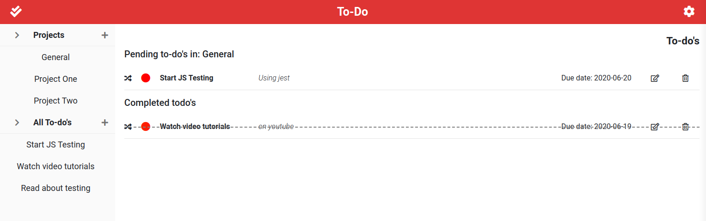

# Todo list webapp



## # Js-TodoList [Live Link]()

## Usage

> Clone the repository to your local machine using ssh:

```bash
git clone git@github.com:leonmezu1/Js-TodoList.git
```

> Clone the repository to your local machine using https:

```bash
git clone https://github.com/leonmezu1/Js-TodoList.git
```

> cd into the directory

```bash
cd Js-TodoList
```

> Run Server Locally

## Functionalities

- Beautiful todo list Web Page
- Vanilla Javascript
- Localstorage
- moduling

## Designed and developed by
- [Raymond Oluoch](https://github.com/rOluochKe)
- [Leonardo Mezu](https://github.com/leonmezu1)